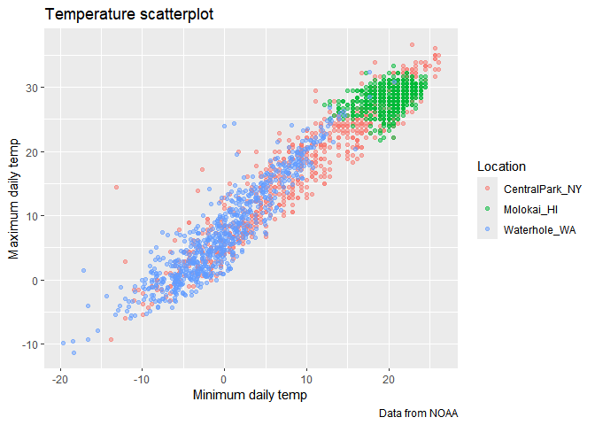
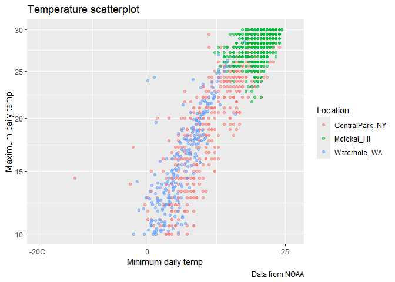
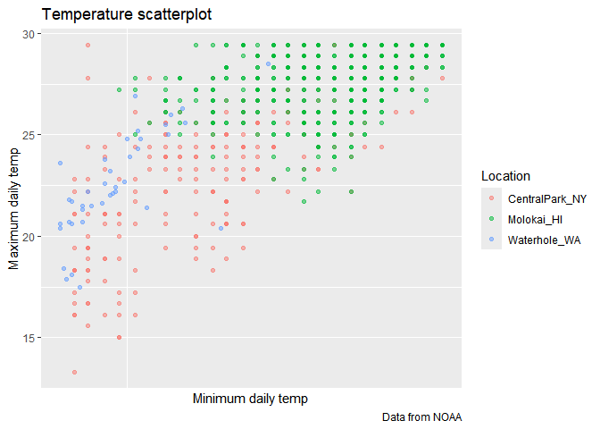
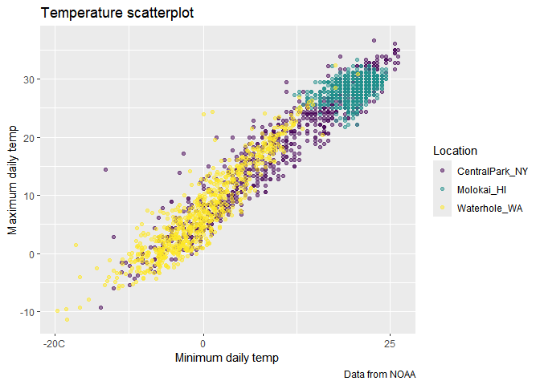
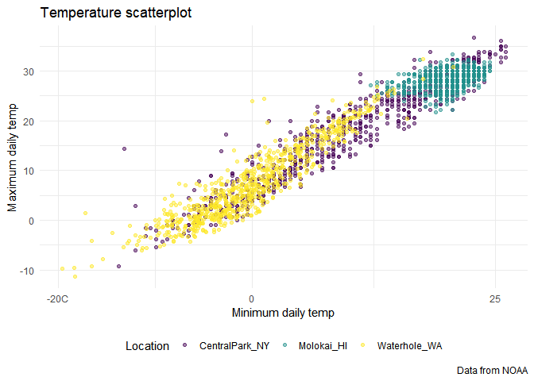
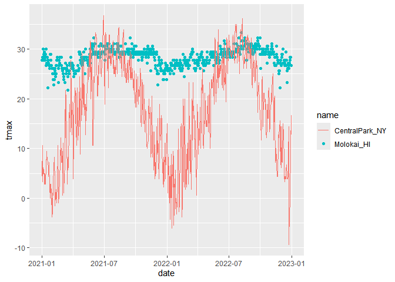

Visualization
================
Fenglin Xie
2025-09-30

``` r
library(tidyverse)
```

    ## ── Attaching core tidyverse packages ──────────────────────── tidyverse 2.0.0 ──
    ## ✔ dplyr     1.1.4     ✔ readr     2.1.5
    ## ✔ forcats   1.0.0     ✔ stringr   1.5.1
    ## ✔ ggplot2   3.5.2     ✔ tibble    3.3.0
    ## ✔ lubridate 1.9.4     ✔ tidyr     1.3.1
    ## ✔ purrr     1.1.0     
    ## ── Conflicts ────────────────────────────────────────── tidyverse_conflicts() ──
    ## ✖ dplyr::filter() masks stats::filter()
    ## ✖ dplyr::lag()    masks stats::lag()
    ## ℹ Use the conflicted package (<http://conflicted.r-lib.org/>) to force all conflicts to become errors

``` r
library(patchwork)
library(p8105.datasets)
```

## load the weather data

``` r
weather_df |> 
  ggplot(aes(x = tmin, y = tmax)) +
  geom_point(aes(colour = name), alpha = 0.5) +
  labs(
    x = "Minimum daily temp",
    y = "Maximum daily temp",
    title = "Temperature scatterplot",
    caption = "Data from NOAA",
    color = "Location"
  )
```

    ## Warning: Removed 17 rows containing missing values or values outside the scale range
    ## (`geom_point()`).

<!-- -->

## Scales

``` r
weather_df |> 
  ggplot(aes(x = tmin, y = tmax)) +
  geom_point(aes(colour = name), alpha = 0.5) +
  labs(
    x = "Minimum daily temp",
    y = "Maximum daily temp",
    title = "Temperature scatterplot",
    caption = "Data from NOAA",
    color = "Location"
  ) +
  scale_x_continuous(
    breaks = c(-20, 0, 25),
    labels = c("-20C", "0", "25")
  ) +
  scale_y_continuous(
    trans = "sqrt",
    limits = c(10, 30)
  )
```

    ## Warning in transformation$transform(x): NaNs produced

    ## Warning in scale_y_continuous(trans = "sqrt", limits = c(10, 30)): sqrt
    ## transformation introduced infinite values.

    ## Warning: Removed 843 rows containing missing values or values outside the scale range
    ## (`geom_point()`).

<!-- -->

限制范围limit另一种

``` r
weather_df |> 
  filter(tmax < 30, tmin > 10) |> 
  ggplot(aes(x = tmin, y = tmax)) +
  geom_point(aes(colour = name), alpha = 0.5) +
  labs(
    x = "Minimum daily temp",
    y = "Maximum daily temp",
    title = "Temperature scatterplot",
    caption = "Data from NOAA",
    color = "Location"
  ) +
  scale_x_continuous(
    breaks = c(-20, 0, 25),
    labels = c("-20C", "0", "25")
  )
```

<!-- -->

\##挑选颜色很重要，颜色变化不明显不好

``` r
weather_df |> 
  ggplot(aes(x = tmin, y = tmax)) +
  geom_point(aes(colour = name), alpha = 0.5) +
  labs(
    x = "Minimum daily temp",
    y = "Maximum daily temp",
    title = "Temperature scatterplot",
    caption = "Data from NOAA",
    color = "Location"
  ) +
  scale_x_continuous(
    breaks = c(-20, 0, 25),
    labels = c("-20C", "0", "25")
  ) +
  viridis::scale_color_viridis(
    name = "Location", 
    discrete = TRUE
  )
```

    ## Warning: Removed 17 rows containing missing values or values outside the scale range
    ## (`geom_point()`).

<!-- -->

## Themes

Make my base plot

``` r
ggp_temperature =
weather_df |> 
  ggplot(aes(x = tmin, y = tmax)) +
  geom_point(aes(colour = name), alpha = 0.5) +
  labs(
    x = "Minimum daily temp",
    y = "Maximum daily temp",
    title = "Temperature scatterplot",
    caption = "Data from NOAA",
    color = "Location"
  ) +
  scale_x_continuous(
    breaks = c(-20, 0, 25),
    labels = c("-20C", "0", "25")
  ) +
  viridis::scale_color_viridis(
    name = "Location", 
    discrete = TRUE
  )
```

update my base plot legend.position:图例位置

themes_minimal:忘记之前所有的设计？？（不确定，再听一遍）

``` r
ggp_temperature +
  theme_minimal() +
  theme(legend.position = "bottom")
```

    ## Warning: Removed 17 rows containing missing values or values outside the scale range
    ## (`geom_point()`).

<!-- -->

## Adding data in geoms

``` r
central_park_df =
  weather_df |> 
  filter(name == "CentralPark_NY")

molokai_df =
  weather_df |> 
  filter(name == "Molokai_HI")

ggplot(data = molokai_df, aes(x = date, y = tmax, colour = name)) +
  geom_point() +
  geom_line(data = central_park_df)
```

    ## Warning: Removed 1 row containing missing values or values outside the scale range
    ## (`geom_point()`).

<!-- -->
